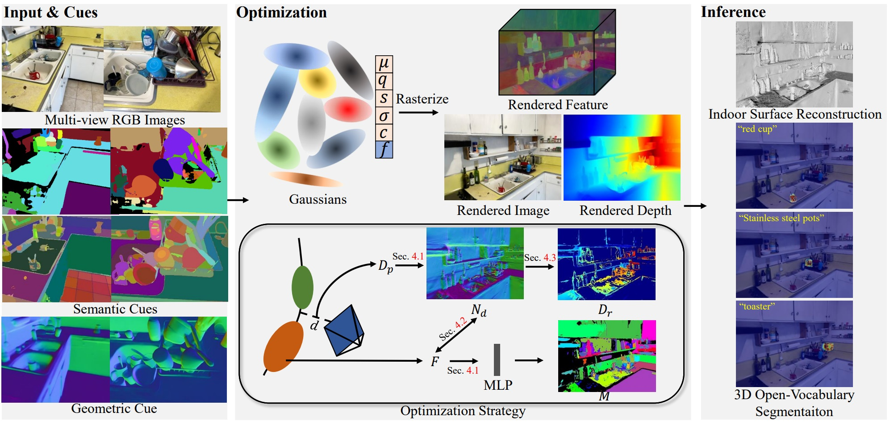

# GLS: Geometry-aware 3D Language Gaussian Splatting

[](https://jiaxiongq.github.io/GLS_ProjectPage/)
[](https://arxiv.org/pdf/2411.18066)


In this work, we present GLS, a novel 3DGS-based framework that effectively combines indoor surface reconstruction and 3D open-vocabulary segmentation. We propose leveraging 2D geometric and semantic cues to optimize the performance of 3DGS on two tasks jointly. We design two novel regularization terms to enhance the sharpness and smoothness of the scene surface, and then improve the segmentation quality. Comprehensive experiments on both 3D open-vocabulary segmentation and indoor surface reconstruction tasks illustrate that GLS outperforms state-of-the-art methods quantitatively and qualitatively. 




---

## Quick Start

### Environment Setup
```sh
conda create -n gls python=3.9 -y
conda activate gls

git clone https://github.com/HorizonRobotics/GLS.git
cd GLS

git submodule update --init --recursive --progress
bash install.sh
```
Please install segment-anything-langsplat and download the checkpoints of SAM from here to ckpts/

---

## Preprocess

### Before getting started
Firstly, put your images into the data dir.
```
<dataset_name>
|---images
|   |---<image 0>
|   |---<image 1>
|   |---...
```
Secondly, you need to acquire the following dataset format and a pre-trained RGB model follow the [DN-Splatter](https://github.com/maturk/dn-splatter) repository.


### Extract semantic cues

#### CLIP features

- **Step 0: Environment setup.**
  Please download the checkpoints of SAM from [here](https://github.com/facebookresearch/segment-anything) to ```ckpts/```.

- **Step 1: Generate Language Feature of the Scenes.**
  Put the image data into the "images" directory under the ```<dataset_name>/```, then run the following command:
  ```
  python preprocess.py --dataset_path $dataset_path 
  ```
- **Step 2: Train the Autoencoder and get the lower-dims Feature.**
  ```
  # train the autoencoder
  cd autoencoder
  bash train.sh $dataset_path $dataset_name
  bash test.sh $dataset_path $dataset_name
  ```

#### DEVA masks

Please follow [install.md](https://github.com/lkeab/gaussian-grouping/blob/main/docs/install.md) to prepare [DEVA](https://github.com/hkchengrex/Tracking-Anything-with-DEVA) masks, the correspoding checkpoints can be stored to ```ckpts/```.

### Extract geometry cues

Please follow [DSINE](https://github.com/baegwangbin/DSINE) to prepare normal priors, the result should be saved under ```normals```.

Our model expect the following dataset structure in the source path location:
```
<dataset_name>
|---images
|   |---<image 0>
|   |---<image 1>
|   |---...
|---language_features
|   |---00_f.npy
|   |---00_s.npy
|   |---...
|---language_features_dim16
|   |---00_f.npy
|   |---00_s.npy
|   |---...
|---object_mask
|   |---00.png
|   |---00.png
|   |---...
|---normals
|   |---00.png
|   |---00.png
|   |---...
|---sparse
    |---0
        |---cameras.bin
        |---images.bin
        |---points3D.bin
```

---
## Training

Specify ```scenes```, ```data_base_path```, ```out_base_path``` and ```gpu_id``` in ```scripts/run_train.py```, then run the following command:
```sh
python scripts/run_train.py
```
---

## Inference

### 3D surface reconstruction

Specify ```scenes```, ```data_base_path```, ```out_base_path``` and ```gpu_id``` in ```scripts/run_mesh.py```, then run the following command:
```sh
python scripts/run_mesh.py
```
Results of reconstructed mesh will be saved in  ```out_base_path/.../possion_mesh```.

### 3D open-vocabulary segmentation

Specify ```scenes```, ```data_base_path```, ```out_base_path``` and ```gpu_id``` in ```scripts/run_mesh.py```, then change ```img_labels``` in ```edit_object_eval.py``` and run the following command:
```sh
python scripts/run_seg.py
```
Results of segmented objects will be saved in  ```out_base_path/.../train/ours_30000/render_select_obj_pip``` .

---

## Applications

### Interactive tool

Specify ```scenes```, ```data_base_path```, ```out_base_path``` and ```gpu_id``` in ```scripts/run_train.py```, then run the following command:
```sh
python scripts/run_vis.py
```

More demos are shown in [](https://jiaxiongq.github.io/GLS_ProjectPage/).

---

## Citation

If you use EmbodiedGen in your research or projects, please cite:

```bibtex
@article{qiu2024gls,
  title={GLS: Geometry-aware 3D Language Gaussian Splatting},
  author={Qiu, Jiaxiong and Liu, Liu and Wang, Xinjie and Lin, Tianwei and Sui, Wei and Su, Zhizhong},
  journal={arXiv preprint arXiv:2411.18066},
  year={2024}
}
```

---

## Acknowledgement

GLS is built upon the following great projects:
🌟 [3DGS](https://github.com/graphdeco-inria/gaussian-splatting) | 🌟 [PGSR](https://github.com/zju3dv/PGSR) | 🌟 [DSINE](https://github.com/baegwangbin/DSINE) | 🌟 [DEVA](https://github.com/hkchengrex/Tracking-Anything-with-DEVA) | 🌟 [Gaussian Grouping](https://github.com/lkeab/gaussian-grouping) | 🌟 [LangSplat](https://github.com/minghanqin/LangSplat) | 🌟 [nerfview](https://github.com/nerfstudio-project/nerfview) | 🌟 [GPT4o](https://platform.openai.com/docs/models/gpt-4o)

Thank them very much!

---

## License

This project is licensed under the [Apache License 2.0](LICENSE). See the `LICENSE` file for details.